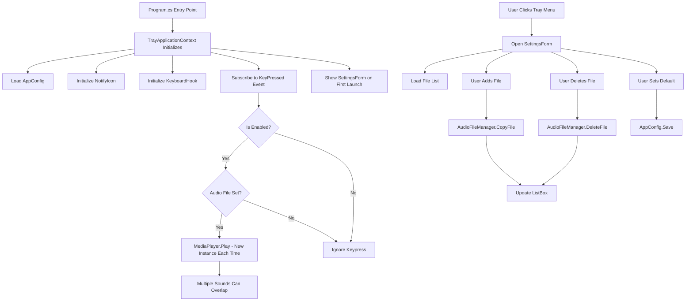

# W

indows Keyboard Sound App - Implementation Plan

## Technology Stack

- **Framework**: C# .NET 8 (Windows Forms) - works out of the box on Windows 10/11
- **IDE**: Visual Studio Code with C# extensions
- **Key Libraries**: 
- Win32 API (P/Invoke) for global keyboard hooks
- `System.Windows.Forms` for UI and system tray
- `System.Windows.Media.MediaPlayer` (WPF reference) for MP3 playback
- `System.Text.Json` (built-in) for settings persistence

## Prerequisites & Setup (VS Code)

### 1. Install .NET SDK

- Download from: https://dotnet.microsoft.com/download
- Install .NET 8 SDK (or .NET 6+)
- Verify installation: Open terminal, run `dotnet --version`

### 2. Install VS Code Extensions

- Open VS Code Extensions (Ctrl+Shift+X)
- Install **C# Dev Kit** (recommended) - Provides IntelliSense, debugging, project management
- OR install **C#** extension (lighter alternative) - Basic C# language support
- Both provide: IntelliSense, code completion, debugging, build integration

### 3. Verify Setup

- Open integrated terminal in VS Code (Ctrl+`)
- Run `dotnet --version` to confirm .NET SDK is installed
- Run `dotnet --list-sdks` to see installed SDKs

## Project Structure

```javascript
Keyboard-Sound/
├── KeyboardSoundApp/
│   ├── Properties/
│   │   └── Resources.resx (for icons, embedded resources)
│   ├── Program.cs (entry point)
│   ├── TrayApplicationContext.cs (system tray application context - manages tray and app lifecycle)
│   ├── SettingsForm.cs (file management UI)
│   ├── KeyboardHook.cs (global keyboard hook wrapper)
│   ├── AudioFileManager.cs (file operations, validation)
│   ├── AppConfig.cs (configuration persistence - System.Text.Json)
│   ├── Logger.cs (debug logging utility)
│   ├── SettingsForm.Designer.cs (UI layout - manually written in VS Code)
│   └── app.config (optional - for app settings)
├── Sounds/ (existing sound files)
├── Icons/ (tray icon .ico file)
└── KeyboardSoundApp.sln (solution file)
```


## Core Components Implementation

### 1. KeyboardHook.cs

- **Purpose**: Capture global keyboard events via Win32 API
- **Methods**: 
- `InstallHook()` - sets up `WH_KEYBOARD_LL` hook
- `UninstallHook()` - removes hook (critical for cleanup)
- `HookCallback()` - processes keypress events
- **P/Invoke**: Uses `SetWindowsHookEx`, `CallNextHookEx`, `UnhookWindowsHookEx`
- **Event**: Fires `KeyPressed` event on each keypress

### 2. AudioFileManager.cs

- **Purpose**: Manage audio files (add, delete, list, validate)
- **Storage**: Files copied to `%AppData%/KeyboardSoundApp/AudioFiles/`
- **Methods**:
- `AddFile(string sourcePath)` - copies file, validates, returns success
- `DeleteFile(string fileName)` - removes from storage
- `GetAllFiles()` - returns list of available files
- `ValidateAudioFile(string path)` - checks extension and format
- `GetStoragePath()` - returns app data directory

### 3. AppConfig.cs

- **Purpose**: Persist settings (default file, enabled state)
- **Storage**: JSON file using System.Text.Json (located at `%AppData%\KeyboardSoundApp\config.json`)
- **Properties**: 
- `DefaultAudioFile` (string) - empty by default, only set when user explicitly chooses
- `IsEnabled` (bool) - defaults to true
- `Save()`, `Load()` methods
- **Important**: No file is auto-set as default - user must explicitly select via Settings form

### 4. TrayApplicationContext.cs

- **Purpose**: System tray application context (manages application lifecycle without a main form)
- **Pattern**: Uses `ApplicationContext` - the proper pattern for system tray-only applications
- **Components**:
- `NotifyIcon` - system tray icon with context menu
- `ContextMenuStrip` - menu items: "Settings", "Enable/Disable", "Exit"
- **Behavior**: 
- No form window - application runs entirely in system tray
- Shows `SettingsForm` on first launch (appears in taskbar naturally)
- Settings form closes → app stays running in system tray
- Opens `SettingsForm` from tray menu (modal dialog)
- **Integration**: 
- Instantiates `KeyboardHook`
- Uses `AudioFileManager` to get default file (only if explicitly set)
- Uses `MediaPlayer` to play sound on keypress (allows overlapping playback)
- **Cleanup**: Proper disposal via `ExitThreadCore()` method

### 5. SettingsForm.cs

- **Purpose**: Simple UI for managing audio files
- **UI Components**:
- `ListBox` - displays available audio files
- `Button "Add File"` - opens `OpenFileDialog` (filter: *.mp3,*.wav,*.wma,*.m4a)
- `Button "Delete"` - removes selected file (with confirmation)
- `Button "Set as Default"` - saves selected file to config
- `Button "Close"` - closes settings window
- `CheckBox "Enable"` - toggle app on/off
- **Functionality**:
- Loads file list on open
- Highlights current default file
- Refreshes list after add/delete operations

### 6. Logger.cs

- **Purpose**: File-based logging for debugging
- **Storage**: Log file at `%AppData%\KeyboardSoundApp\debug.log`
- **Methods**:
- `Log(string message)` - writes timestamped log entry to file and debug output
- `LogError(string message, Exception? ex)` - logs errors with exception details
- **Usage**: Called throughout application to track execution flow and errors

### 7. Program.cs

- **Purpose**: Application entry point
- **Code**: Windows Forms entry point with `Application.Run(new TrayApplicationContext())`
- Uses ApplicationContext pattern for system tray application
- Includes logging for startup/shutdown tracking

## Implementation Flow




## Key Technical Decisions

1. **Audio Playback**: Use `System.Windows.Media.MediaPlayer` (requires WPF reference) for MP3 support

- Each keypress creates a new MediaPlayer instance to allow overlapping sounds
- No Thread.Sleep blocking - fire and forget approach

2. **File Storage**: Copy files to AppData folder (user-specific, survives app updates)
3. **Hook Threading**: Keyboard hook runs on separate thread - ensure thread-safe event handling
4. **Settings Storage**: Use JSON file with System.Text.Json (built-in to .NET 8, no NuGet needed)

- Default audio file is NOT auto-set - user must explicitly select via Settings

5. **Application Pattern**: Uses `ApplicationContext` instead of hidden Form - proper pattern for system tray apps

- No main form window - runs entirely in system tray
- Settings form shows on first launch (appears in taskbar naturally)
- Cleaner code without form lifecycle workarounds

6. **Icon**: Currently uses SystemIcons.Application - can be replaced with custom .ico file (16x16, 32x32 sizes)
7. **Debugging**: Logger.cs class for file-based logging (writes to %AppData%\KeyboardSoundApp\debug.log)

## Development Steps

1. **Setup Project** (VS Code)

- Open terminal in VS Code (Ctrl+`)
- Create Windows Forms project: `dotnet new winforms -n KeyboardSoundApp`
- Navigate to project: `cd KeyboardSoundApp`
- Edit `.csproj` file to enable WPF (for MediaPlayer):
- Add or update: `<UseWindowsForms>true</UseWindowsForms>` and `<UseWPF>true</UseWPF>`
- Or manually add WPF references if needed
- Note: No NuGet packages needed - using System.Text.Json (built-in)
- Open project in VS Code: `code .` (if not already in VS Code)
- Build to verify: `dotnet build`

**Note**: In VS Code, Designer.cs files are NOT auto-generated. You'll write them manually using code to initialize controls (see UI Implementation section below)

2. **Implement Core Classes** (bottom-up approach)

- `AppConfig.cs` - configuration persistence
- `AudioFileManager.cs` - file operations
- `KeyboardHook.cs` - global keyboard hook

3. **Build UI** (top-down approach)

- `TrayApplicationContext` - system tray context (ApplicationContext pattern)
- `SettingsForm` - file management UI

4. **Integration**

- Wire up keyboard hook to audio playback
- Connect settings form to file manager
- Implement enable/disable functionality
- Add logging throughout application (Logger.cs)

5. **Testing & Refinement**

- Test keyboard capture (press keys in different apps)
- Test system tray behavior (app runs in system tray, Settings form shows on first launch)
- Test file add/delete operations
- Test audio playback (verify overlapping sounds work)
- Test default file selection (verify no auto-selection)
- Verify cleanup on exit
- Check debug log for any issues

## UI Implementation in VS Code

Since VS Code doesn't have a visual designer, you'll write the Designer.cs files manually:

### Approach 1: Manual Designer Files (Recommended)

- Write `SettingsForm.Designer.cs` manually (only SettingsForm needs Designer file)
- TrayApplicationContext doesn't need a Designer file (no form UI)
- Initialize controls in `InitializeComponent()` method
- Example structure:
  ```csharp
          private void InitializeComponent()
          {
              this.button1 = new Button();
              this.button1.Text = "Add File";
              this.button1.Location = new Point(10, 10);
              this.button1.Size = new Size(100, 30);
              this.button1.Click += this.Button1_Click;
              this.Controls.Add(this.button1);
              // ... more controls
              this.Size = new Size(400, 300);
              this.Text = "Settings";
          }
  ```


### Approach 2: Code-Based UI (Alternative)

- Create controls directly in form constructor instead of Designer files
- Simpler for small forms, but less organized
- Can mix with partial Designer.cs files for better organization

### Approach 3: Extension (Optional)

- Install "Simple WinForms Designer for C#" extension from VS Code marketplace
- Provides basic visual designer capabilities (limited functionality)

### VS Code Workflow for UI

- Use IntelliSense for control properties (helps with available options)
- Reference MSDN documentation for control APIs
- Test frequently: `dotnet build` and `dotnet run` to see UI changes

## Files to Create

- `KeyboardSoundApp/KeyboardHook.cs` - Win32 hook wrapper
- `KeyboardSoundApp/AudioFileManager.cs` - file management service
- `KeyboardSoundApp/AppConfig.cs` - settings persistence (uses System.Text.Json)
- `KeyboardSoundApp/Logger.cs` - debug logging utility
- `KeyboardSoundApp/TrayApplicationContext.cs` - system tray application context (ApplicationContext pattern)
- `KeyboardSoundApp/SettingsForm.cs` - settings form (manually create Designer file)
- `KeyboardSoundApp/SettingsForm.Designer.cs` - settings form UI layout (manually written)
- `KeyboardSoundApp/Program.cs` - entry point (uses Application.Run with TrayApplicationContext)
- `Icons/trayicon.ico` - system tray icon (optional - currently uses SystemIcons.Application)

## Configuration Requirements

- Target Framework: .NET 8.0 or higher (Windows Forms support on Windows)
- References: System.Windows.Forms, System.Windows.Media (via UseWPF)
- NuGet Packages: None required (uses built-in System.Text.Json for configuration)
- Project File: Must include `<UseWindowsForms>true</UseWindowsForms>` and `<UseWPF>true</UseWPF>` in .csproj

## Important Notes

- **VS Code Workflow**: Use `dotnet build` to build, `dotnet run` to run, F5 to debug (configure launch.json for debugging)
- **No Visual Designer**: Designer.cs files must be written manually in VS Code - use IntelliSense and documentation
- **Hook Cleanup**: Must properly dispose keyboard hook on app exit to prevent system instability
- **Thread Safety**: Hook events fire on separate thread - use `Invoke()` for UI updates
- **File Paths**: Use `Path.Combine()` for cross-platform path building (even on Windows)
- **Error Handling**: Wrap file operations and hook operations in try-catch
- **Testing**: Run `dotnet run` frequently to test UI changes and functionality
- **Form Behavior**: Form shows in taskbar on first launch, minimizes to tray when closed (user must explicitly set default audio file)
- **Audio Playback**: Each keypress creates a new MediaPlayer instance, allowing overlapping sounds (no Thread.Sleep blocking)

## Debugging & Logging

### Logger Implementation

The application includes a `Logger.cs` class that provides file-based logging:

- **Log File Location**: `%AppData%\KeyboardSoundApp\debug.log`
- Full path example: `C:\Users\<Username>\AppData\Roaming\KeyboardSoundApp\debug.log`
- **Log Format**: Timestamped entries: `[yyyy-MM-dd HH:mm:ss.fff] message`
- **Logging Points**: 
- Application startup/shutdown
- Form initialization
- Configuration loading
- Audio file loading
- Keyboard hook installation/uninstallation
- Hook-level keypress detection (WH_KEYBOARD_LL callback)
- Key press events (KeyPressed event handler)
- Playback instance tracking (unique IDs per keypress)
- Task/thread creation (thread IDs for parallel execution verification)
- MediaPlayer instance creation
- MediaPlayer.Open() timing and completion
- MediaPlayer.Play() timing and completion
- MediaPlayer state (HasAudio, NaturalDuration, Position)
- MediaPlayer events (MediaOpened, MediaEnded, MediaFailed)
- All errors and exceptions

### Viewing Logs

**PowerShell Commands:**

```powershell
# View log file
notepad "$env:APPDATA\KeyboardSoundApp\debug.log"

# View in terminal
Get-Content "$env:APPDATA\KeyboardSoundApp\debug.log"

# Watch log file in real-time (PowerShell)
Get-Content "$env:APPDATA\KeyboardSoundApp\debug.log" -Wait -Tail 50
```

**DebugView (Optional):**

- Download DebugView from Microsoft Sysinternals
- Logger also outputs to `System.Diagnostics.Debug.WriteLine()`
- DebugView can capture these debug messages in real-time

### Enhanced Diagnostic Logging

The application includes comprehensive diagnostic logging for troubleshooting playback issues:**Playback Instance Tracking:**

- Each keypress is assigned a unique playback ID (incremental counter)
- All logs for a specific playback instance are prefixed with `Playback #N`
- Enables tracking individual playback attempts through their lifecycle

**Hook-Level Detection:**

- `HOOK: KeyDown detected` - Logged in KeyboardHook.HookCallback before event invocation
- Timestamp precision: milliseconds (`HH:mm:ss.fff`)
- Confirms keypress detection at the Win32 hook level

**Playback Process Logging:**

- `>>> Starting playback #N` - When keypress handler begins processing
- `Task started on thread X` - Thread ID where MediaPlayer instance is created
- `MediaPlayer instance created` - Instantiation timestamp
- `Initial state: HasAudio=X, CanPause=X` - State before opening media
- `Opening media URI` - File URI being opened
- `MediaPlayer.Open() completed in Xms` - Timing for Open() operation
- `MediaPlayer.Play() completed in Xms` - Timing for Play() operation
- `State: HasAudio=X, NaturalDuration=X, Position=X` - State after Play()
- `<<< Playback #N - Task.Run() returned` - When handler returns (non-blocking)

**MediaPlayer Event Handlers:**

- `MediaOpened event fired` - Confirms media file successfully opened
- `MediaEnded event fired` - Indicates playback completed naturally
- `MediaFailed event fired` - Reports playback failures with exception details

**Diagnostic Use Cases:**

- **Verify keypress detection**: Look for `HOOK: KeyDown detected` entries
- **Verify parallel execution**: Check for different playback IDs and thread IDs
- **Identify MediaPlayer issues**: Check if `MediaOpened` events fire for all instances
- **Check timing bottlenecks**: Review Open() and Play() durations
- **Detect silent failures**: Look for missing `MediaOpened` events or `MediaFailed` events
- **Verify state**: Check `HasAudio`, `NaturalDuration`, and `Position` values

### Common Debugging Tasks

**Check if app is running:**

```powershell
Get-Process -Name "KeyboardSoundApp" -ErrorAction SilentlyContinue
```

**Force stop app (if needed):**

```powershell
Get-Process -Name "KeyboardSoundApp" -ErrorAction SilentlyContinue | Stop-Process -Force
```

**Clear log file (start fresh):**

```powershell
Remove-Item "$env:APPDATA\KeyboardSoundApp\debug.log" -ErrorAction SilentlyContinue
```

**Or clear contents (keep file):**

```powershell
Clear-Content "$env:APPDATA\KeyboardSoundApp\debug.log" -ErrorAction SilentlyContinue
```

**Check configuration file:**

```powershell
notepad "$env:APPDATA\KeyboardSoundApp\config.json"
```

**Check audio files directory:**

```powershell
Get-ChildItem "$env:APPDATA\KeyboardSoundApp\AudioFiles"


```