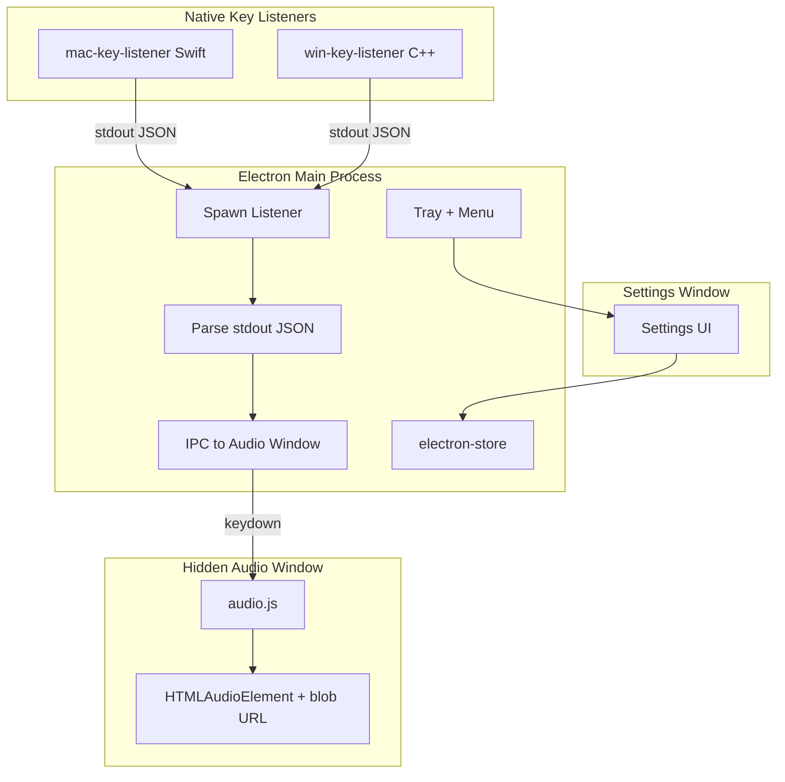

## Built So Far

### Phase 0 (Setup & debug)

- **package.json**: Electron, electron-store, electron-builder; `main: main.js`; scripts `start`, `build:mac`, `build:win`; `"type": "module"` so the main process uses ES modules.
- **Module system (hybrid)**: Main process (`main.js`) is ESM (`import`/`export`). Preload and utils use CommonJS (`.cjs`): `preload.cjs`, `utils/logger.cjs`, etc. Same pattern as animalese-typing-desktop: ESM for main, CJS for preload and shared utils so preload can `require()` them.
- **utils/logger.cjs**: File logger writing to `userData/debug.log`; `log()`, `logError()`; timestamps; console + file.

### Phase 1 (Configuration & tray)

- **electron-store**: Defaults `defaultAudioFile: ''`, `isEnabled: true`; persisted to app userData.
- **Tray**: Created on app ready; no icon supplied (uses `nativeImage.createEmpty()`); tooltip "Keyboard Sound App".
- **Tray menu**: "Settings" (placeholder), "Enable"/"Disable" (from store), "Exit"; menu rebuilt when Enable/Disable is toggled.
- **Enable/Disable**: Toggle updates store and refreshes tray menu; logged.
- **Single instance lock**: `app.requestSingleInstanceLock()`; second instance focuses `settingsWindow` (when present).
- **macOS**: `app.dock.hide()` so app is menu-bar only.
- **Cleanup**: `before-quit` destroys tray; `window-all-closed` quits on Windows, keeps running on macOS.

### Phase 2 (Audio file manager)

- **utils/audio-file-manager.cjs**: Factory `createAudioFileManager(userDataPath)`; storage at `userDataPath/AudioFiles`.
  - **ensureStorageExists()**: Creates `AudioFiles` directory if missing.
  - **validateAudioFile(path)**: Returns true if path has allowed extension (mp3, wav, wma, m4a, aac, ogg, flac).
  - **addFile(sourcePath)**: Copies file into storage; validates extension; on duplicate names appends `" (1)"`, `" (2)"`, etc.; returns boolean.
  - **deleteFile(fileName)**: Removes file from storage; returns boolean (safe: no path traversal).
  - **getAllFiles()**: Returns sorted array of stored audio filenames (extension-filtered).
  - **getFullPath(fileName)**: Returns full path for a stored file, or null.
- **main.js**: Creates manager in `whenReady` with `app.getPath('userData')`, calls `ensureStorageExists()`; logs storage path.
- **IPC handlers** (for Phase 3 settings UI): `add-audio-file`, `delete-audio-file`, `get-audio-files`, `get-audio-file-path`.

### Phase 3 (Settings window)

- **preload.cjs**: contextBridge exposes `api.getStore`, `api.set`, `api.openFileDialog`, `api.showMessageBox`, `api.addAudioFile`, `api.deleteAudioFile`, `api.getAudioFiles`, `api.getAudioFilePath`, `api.closeSettingsWindow`, `api.onSettingUpdate(key, callback)`.
- **settings.html**: Layout matching v1 – Enable checkbox, Audio Files list, Add File / Delete / Set as Default / **Play default sound** / Close buttons, status area; title "Keyboard Sound Settings".
- **renderer/settings.js**: `loadFileList()` from `getAudioFiles()`; Add File (open dialog → `addAudioFile` → refresh); Delete (confirm via `showMessageBox`, clear default if deleted); Set as Default (`set('defaultAudioFile', name)`); **Play default sound** (enabled when a default file is set; on click calls `window.__audioPlay()` – playback respects Enable, so when app is Disabled no sound plays; use to test audio without keypress and isolate permissions vs audio); Close (`closeSettingsWindow`); Enable checkbox binds to `isEnabled`; subscribes `onSettingUpdate` for `isEnabled` and `defaultAudioFile`.
- **main.js**: `createSettingsWindow()` (BrowserWindow, preload, load `settings.html`); show on first launch and from tray "Settings"; on close hide window (app keeps running). IPC: `get-store` (sync), `store-set` (invoke + notify settings with `updated-{key}` + update tray if `isEnabled`), `open-file-dialog` (filters: mp3,wav,wma,m4a,aac,ogg,flac), `show-message-box`, `close-settings-window` (hide). Tray Enable/Disable sends `updated-isEnabled` to settings so checkbox stays in sync.

### Phase 4 (Custom protocol for audio files)

- **main.js**: `protocol.registerSchemesAsPrivileged` for `app-audio` (before app ready). In `whenReady`, `protocol.handle('app-audio', handler)`: parse request URL pathname to get filename, serve file from `userData/AudioFiles/<filename>` with correct MIME type (mp3, wav, ogg, m4a, aac, flac, wma); return 404 if file missing. Log each request.
- **preload.cjs**: `api.getAudioFileUrl(fileName)` – returns `app-audio://audio/${encodeURIComponent(fileName)}` (sync). Used by audio.js to fetch audio; playback uses blob URL (see Phase 5).

### Phase 5 (Audio playback, no keyboard yet)

- **renderer/audio.js**: **HTMLAudioElement + blob URL** (no Web Audio `decodeAudioData`). On macOS, `decodeAudioData()` in any renderer disposes the frame; `<audio>` with a blob URL works. Flow: fetch `app-audio://` URL → `response.blob()` → `URL.createObjectURL(blob)`; cache one blob URL per default file (`cachedBlobUrl`). On each keydown: `new Audio(blobUrl).play()` (overlapping: each keydown creates a new Audio instance). `app-audio://` cannot be used directly as `<audio src>` (Chromium reports "no supported source"); blob URL is required. No decode on load; "Set as Default" only updates `defaultFileName` and revokes old blob URL; next play fetches and caches new blob. Subscribes `onSettingUpdate('defaultAudioFile')` and `onSettingUpdate('isEnabled')`. `window.__audioPlay()` for manual test.
- **settings.html**: Script tag for `renderer/audio.js` after `settings.js` so settings window can use `__audioPlay()` when open; keydown→play runs in the hidden audio window (Phase 7).

### Phase 6 (Native key listeners)

- **libs/key-listeners/mac-key-listener.swift**: CGEvent tap, keyDown only; outputs `{"keydown": keyCode}` per line to stdout. Binary: `keyboard-sound-listener`. Build: `npm run build:mac-listener`.
- **libs/key-listeners/win-key-listener.cpp**: WH_KEYBOARD_LL, WM_KEYDOWN/WM_SYSKEYDOWN; same JSON to stdout. Binary: `keyboard-sound-listener.exe`. Build: `npm run build:win-listener`.

### Phase 7 (Key capture → playback)

- **main.js**: **Hidden audio window**: `createAudioWindow()` creates a BrowserWindow with `show: false`, loads `audio.html` (only `renderer/audio.js`). Never shown; used only for keydown→play so playback works when settings is closed and we avoid running heavy decode in the visible window. `safeSendToAudio(channel, ...args)` sends to audio window. Keydown is sent to **audio window only** (`safeSendToAudio('keydown', { keycode, when })`), not settings. Store updates (`store-set`, tray Enable/Disable) call both `safeSendToSettings('updated-...')` and `safeSendToAudio('updated-...')` so both windows stay in sync. `getListenerPath()`, `startKeyListener()`, `stopKeyListener()` as before; logs `[Main] keydown key=N at <ISO time> -> sending to audio window`. Listener started when `isEnabled` on ready and when user enables; stopped when user disables. Before-quit: stop listener, close audio window, then settings.
- **audio.html**: Minimal page that loads only `renderer/audio.js` (no settings UI).
- **preload.cjs**: `api.onKeyDown(callback)` – IPC listener for `keydown` channel; callback receives `{ keycode, when }`. Also `api.logToMain(msg)` for renderer→main logs.
- **renderer/audio.js**: Subscribes `api.onKeyDown`; on each keydown calls `play(payload)`. Debug logs: `[Rdr] audio: keydown key=N at <when> -> sound played` (or `-> play failed ...` / `-> skipped (no blob)`). `window.__audioPlay()` still works for manual test (in settings or audio window).

**Current project structure (after Phase 7):**

```
KeyboardSoundApp-v2/
├── package.json
├── main.js
├── preload.cjs
├── settings.html
├── audio.html
├── renderer/
│   ├── settings.js
│   └── audio.js
├── libs/
│   └── key-listeners/
│       ├── mac-key-listener.swift
│       ├── win-key-listener.cpp
│       └── keyboard-sound-listener[.exe]  (built)
└── utils/
    ├── logger.cjs
    └── audio-file-manager.cjs
```

No app icon is supplied yet; tray uses an empty icon. Add `assets/icons/icon.png` (e.g. 16×16) later and switch `getTrayIcon()` to load it.

---

# Keyboard Sound App v2 - Electron Build Plan

## v1 Requirement Alignment

Every v1 requirement from [Keyboard Sound App v1 Plan.md](.cursor/plans/Keyboard%20Sound%20App%20v1%20Plan.md) maps to a v2 implementation as follows:

| v1 Requirement | v1 Implementation | v2 Implementation |

|----------------|-------------------|-------------------|

| Global keyboard capture | Win32 `WH_KEYBOARD_LL` hook | Native key listener binary (Swift on macOS, C++ on Windows) spawned as child process; emits JSON keydown to stdout |

| KeyPressed event on each keypress | KeyboardHook.KeyPressed | Listener outputs `{"keydown": keycode}`; main process parses and sends to renderer |

| Play sound on keypress | MediaPlayer, new instance per keypress | HTMLAudioElement + blob URL: fetch app-audio → blob → createObjectURL; each keydown creates new Audio(blobUrl).play(); no Web Audio decodeAudioData (avoids macOS renderer frame dispose) |

| Overlapping playback | Fire-and-forget Task.Run per keypress | Each keydown creates new Audio instance; no keyup needed |

| Settings form with file management | WinForms SettingsForm | BrowserWindow loading `settings.html`; same UI components |

| Add File (filter: mp3,wav,wma,m4a,aac,ogg,flac) | OpenFileDialog | `dialog.showOpenDialog` with filters |

| Delete File (with confirmation) | MessageBox confirmation | `dialog.showMessageBox` with Yes/No |

| Set as Default | Saves to AppConfig | Saves to electron-store |

| Enable checkbox | AppConfig.IsEnabled | electron-store `isEnabled` |

| Default NOT auto-set | User must select | Same; no auto-selection |

| If deleted file was default, clear default | Logic in ButtonDelete_Click | Same logic in renderer |

| Config: DefaultAudioFile, IsEnabled | AppConfig (JSON in AppData) | electron-store (JSON in app userData) |

| File storage in AppData | %AppData%/KeyboardSoundApp/AudioFiles | app.getPath('userData')/AudioFiles |

| Tray: Settings, Enable/Disable, Exit | NotifyIcon + ContextMenuStrip | Electron Tray + Menu |

| Settings on first launch | ShowSettingsForm() in constructor | Show settings window on app ready (first run) |

| Settings from tray menu | Click "Settings" opens modal | Click "Settings" shows/focuses settings window |

| App runs in tray, no main form | ApplicationContext pattern | No main window; tray-only with settings as separate window |

| Proper cleanup on exit | ExitThreadCore, UnhookWindowsHookEx | before-quit: stop listener, kill process, destroy tray |

| Debug logging | Logger.cs to %AppData%/debug.log | Optional: console or file logger to userData/debug.log |

**Platform scope**: v2 targets macOS + Windows only (no Linux). v1 was Windows-only; v2 extends to macOS via the same Electron codebase.

---

## Architecture Overview



---

## Data Flow (Keypress to Sound)

```mermaid
sequenceDiagram
    participant User
    participant Listener as Native Listener
    participant Main as Main Process
    participant AudioWin as Hidden Audio Window
    participant HTMLAudio as HTMLAudioElement

    User->>Listener: Press key
    Listener->>Main: stdout: {"keydown": 65}
    Main->>Main: Parse JSON
    Main->>AudioWin: safeSendToAudio('keydown', {keycode, when})
    AudioWin->>AudioWin: Check isEnabled, default file; ensure blob URL (fetch if needed)
    AudioWin->>HTMLAudio: new Audio(blobUrl).play()
    HTMLAudio->>User: Play sound (overlapping allowed)
```

---

## Project Structure

```
KeyboardSoundApp-v2/
├── package.json
├── main.js
├── preload.cjs
├── settings.html
├── audio.html
├── renderer/
│   ├── settings.js
│   └── audio.js
├── libs/
│   └── key-listeners/
│       ├── mac-key-listener.swift
│       ├── win-key-listener.cpp
│       └── keyboard-sound-listener[.exe]  (built)
├── assets/
│   └── icons/
│       ├── icon.png
│       └── icon.ico
└── utils/
    ├── logger.cjs
    └── audio-file-manager.cjs
```

---

## Implementation Details

### 1. Project Setup

- **package.json**: Electron, electron-store, electron-builder. No Howler. Target macOS + Windows.
- **Scripts**: `start`, `build:mac-listener`, `build:win-listener`, `build:mac`, `build:win`
- **electron-builder**: `extraResources` for listener binaries; mac (dmg, arm64+x64), win (nsis); no linux config

### 2. Native Key Listeners (Simplified)

**mac-key-listener.swift** (from animalese, simplified):

- Event mask: keyDown only (no keyUp)
- Output: `{"keydown": keyCode}` per line (no shift/ctrl/alt)
- CGEvent tap, JSON via print + fflush

**win-key-listener.cpp** (from animalese, simplified):

- Handle WM_KEYDOWN and WM_SYSKEYDOWN only
- Output: `{"keydown": vkCode}` per line
- WH_KEYBOARD_LL hook, JSON via std::cout

**Optional**: Filter modifier-only keys (Shift, Ctrl, Alt, Win, Caps Lock) in the listener so holding modifiers alone does not trigger sound. v1 does not explicitly filter; include for better UX.

Binary names: `keyboard-sound-listener` (macOS) and `keyboard-sound-listener.exe` (Windows). Build outputs go to `libs/key-listeners/`.

#### Native key listeners: differences from animalese-typing-desktop

| Aspect | animalese-typing-desktop (reference) | Keyboard Sound App v2 (custom) |
|--------|--------------------------------------|--------------------------------|
| **Purpose** | Typing sounds with character/pitch variation (Animalese-style) | One sound per keypress; no character or pitch logic |
| **Output** | May emit character, key, or pitch for synthesis | Single JSON line per keydown: `{"keydown": keyCode}` only |
| **Key handling** | May map key to character, filter by key type, or drive pitch | Every keydown → one event → one play; no mapping or filtering in listener |
| **Main process** | May parse character/pitch and send to renderer for synthesis | Parses keycode and timestamp; forwards `{ keycode, when }` to renderer for debug logs and play |
| **Renderer** | May vary pitch/volume by character or key | Always plays the same default file via blob URL (HTMLAudioElement); overlapping allowed |
| **Complexity** | Listener and/or main may do character logic, pitch tables | Listener: keyDown → print JSON. Main: parse → send. Renderer: play(). Minimal pipeline |

### 3. Main Process (main.js)

- **Tray**: Create on app ready. Menu items: "Settings", "Enable"/"Disable" (toggle), "Exit". Icon from assets. Tooltip: "Keyboard Sound App".
- **Settings window**: Create on demand. Load `settings.html`. Frame: true. Size ~420x420. On close: hide (app stays running). IPC: `safeSendToSettings(channel, ...)` for store updates and UI sync.
- **Audio window (hidden)**: Create on app ready via `createAudioWindow()`. Load `audio.html` (only `renderer/audio.js`). Never shown. Receives keydown via `safeSendToAudio('keydown', { keycode, when })`. Store updates also sent with `safeSendToAudio('updated-{key}', value)` so audio window stays in sync. Playback runs here so keypresses work when settings is closed; avoids running decode in the visible window (we use HTMLAudioElement + blob URL, no decodeAudioData).
- **First launch**: Show settings window once on app ready (mirror v1 "Show Settings form on first launch").
- **Config**: electron-store with `defaultAudioFile` (string, empty), `isEnabled` (boolean, true). Store path: default userData.
- **Key listener**:
  - Spawn path: dev = `libs/key-listeners/keyboard-sound-listener[.exe]`, packaged = `process.resourcesPath/keyboard-sound-listener[.exe]`
  - Parse stdout: each line = JSON. Expect `{"keydown": N}`. Forward to **audio window** via `safeSendToAudio('keydown', { keycode, when })` (not settings window).
  - Start only when `isEnabled` is true. Stop on disable, sleep, or quit.
- **Single instance lock**: `app.requestSingleInstanceLock`; second instance focuses settings window.
- **Cleanup**: before-quit: stop listener (kill), destroy tray, close audio window, close settings window.

### 4. Preload (preload.cjs)

Expose to renderer via contextBridge:

- `api.onKeyDown(callback)` - IPC listener for keydown; callback receives `{ keycode, when }`
- `api.getStore()` - sync get full store (for initial load)
- `api.set(key, value)` - async set store; main sends `updated-{key}` to both settings and audio window
- `api.getAudioFileUrl(fileName)` - returns `app-audio://audio/${encodeURIComponent(fileName)}` (used by audio.js for fetch → blob → play)
- `api.openFileDialog()`, `api.showMessageBox(options)`, `api.addAudioFile`, `api.deleteAudioFile`, `api.getAudioFiles`, `api.getAudioFilePath`, `api.closeSettingsWindow`
- `api.onSettingUpdate(key, callback)` - listen for `updated-{key}` (sent to both windows)
- `api.logToMain(msg)` - send renderer log to main (logged as `[Rdr] ...`)

Preload runs in isolated context; use nodeIntegration: false, contextIsolation: true.

### 5. Audio File Manager (utils/audio-file-manager.cjs)

Node/CommonJS module (used from main and preload):

- **Storage path**: `path.join(app.getPath('userData'), 'AudioFiles')` - ensures directory exists.
- **AddFile(sourcePath)**: Copy to storage, handle duplicate names (append " (1)", " (2)", etc.). Validate extension (mp3, wav, wma, m4a, aac, ogg, flac). Return success boolean.
- **DeleteFile(fileName)**: Remove from storage. Return success boolean.
- **GetAllFiles()**: List files in storage, filtered by allowed extensions, sorted. Return array of filenames.
- **GetFullPath(fileName)**: Return full path for a stored file.
- **ValidateAudioFile(path)**: Check extension against allowed list.

### 6. Settings UI (settings.html + renderer/settings.cjs)

**UI components** (mirror v1 SettingsForm):

- **ListBox**: `<select multiple>` or styled list showing `GetAllFiles()`. Highlight selected. Show current default (e.g. bold or checkmark).
- **Add File button**: Calls `api.openFileDialog()` with filter `*.mp3,*.wav,*.wma,*.m4a,*.aac,*.ogg,*.flac`. On path returned, main copies via AudioFileManager, then refresh list.
- **Delete button**: Enabled when item selected. Confirmation via `api.showMessageBox` (Yes/No). If deleted file was default, clear default in store. Refresh list.
- **Set as Default button**: Enabled when item selected. Save `defaultAudioFile` to store. Update button label to "Default (Current)" when selected item is default.
- **Play default sound button**: Enabled when a default file is set. On click calls `window.__audioPlay()` to play the current default file (respects Enable – no sound when app is Disabled). Use to verify audio playback without keypress (e.g. isolate permissions vs audio in packaged app).
- **Enable checkbox**: Binds to `isEnabled`. Save on change. Updates tray menu label (Enable/Disable).
- **Close button**: Closes settings window (hide or destroy per design).

Load file list on open. Reload config from store on show. Wire `onSettingUpdate` for `isEnabled` and `defaultAudioFile` to keep UI in sync.

### 7. Audio Playback (renderer/audio.js)

- **HTMLAudioElement + blob URL** (no Web Audio `decodeAudioData`): On macOS, `decodeAudioData()` in any renderer disposes the frame; playback uses `<audio>` with a blob URL instead. Flow: `fetch(api.getAudioFileUrl(defaultFileName))` (app-audio protocol) → `response.blob()` → `URL.createObjectURL(blob)`; cache one blob URL per default file (`cachedBlobUrl`). On default change, revoke old blob URL. `<audio src="app-audio://...">` is not a supported source in Chromium ("no supported source was found"); blob URL is required.
- **Play on keydown**: `api.onKeyDown` receives `{ keycode, when }`. Check `isEnabled` and `defaultAudioFile`. Call `ensureBlobUrl()` (fetch + blob + createObjectURL if not cached), then `new Audio(blobUrl).play()`. Debug log: `[Rdr] audio: keydown key=N at <when> -> sound played` (or play failed / skipped).
- **Overlapping**: Each keydown creates a new `Audio` instance; multiple can play simultaneously.
- **Where it runs**: Hidden audio window (always) and settings window (for `__audioPlay()` when settings open). Keydown is sent only to the audio window.
- **Volume**: Use default 1.0; v1 uses Volume = 1.0.

### 8. Packaging

- **macOS**: Build listener for arm64 + x64, lipo to universal binary. `extraResources` from `libs/key-listeners/keyboard-sound-listener` to `keyboard-sound-listener`. Optional afterSign for notarization.
- **Windows**: Build listener to `.exe`. `extraResources` from `libs/key-listeners/keyboard-sound-listener.exe` to `keyboard-sound-listener.exe`.
- Output: `exports/` or similar. Artifact names: `KeyboardSoundApp-Setup-{arch}.{ext}`.

---

## Key Technical Decisions

| Decision | Rationale |

|----------|-----------|

| HTMLAudioElement + blob URL (no Web Audio decodeAudioData) | On macOS, decodeAudioData() in any renderer disposes the frame; <audio> with blob URL works. Fetch app-audio → blob → createObjectURL; each keydown new Audio(blobUrl).play(). Overlapping: multiple Audio instances. |

| Keydown only | v1 only needs "key pressed" -> play. No sustained notes or keyup logic. |

| Simplified JSON `{"keydown": N}` | Minimal protocol; main process parses and forwards. Keycode retained for optional modifier filtering. |

| electron-store | Mirrors v1 AppConfig; persists defaultAudioFile and isEnabled. |

| userData/AudioFiles | Mirrors v1 %AppData%/KeyboardSoundApp/AudioFiles. Survives updates. |

| macOS + Windows only | Reduces scope; Linux omitted for v2. Can add later. |

| Settings window separate from tray | Mirrors v1: no main form, tray + modal settings. Hidden audio window for keydown→play so playback works when settings closed. |

---

## Verification Checklist (v1 Parity)

- [ ] Global keypress triggers sound when focused in any app
- [ ] Multiple rapid keypresses produce overlapping sounds
- [ ] Add File: dialog filters mp3,wav,wma,m4a,aac,ogg,flac; file copied to userData/AudioFiles
- [ ] Delete File: confirmation dialog; if default deleted, default cleared
- [ ] Set as Default: only when user explicitly selects; no auto-set
- [ ] Enable checkbox: toggles app on/off; tray menu reflects state
- [ ] Settings opens on first launch
- [ ] Settings opens from tray "Settings" click
- [ ] App stays running when settings closed (tray remains)
- [ ] Clean exit: listener killed, tray destroyed, no lingering processes

---

## Build Commands

```bash
# Dev: build listeners first, then
npm start

# Package macOS
npm run build:mac

# Package Windows
npm run build:win
```

---

## Testing (Phase 2 and Phase 3)

### Phase 2 (Audio file manager)

1. **Run the app**: From `KeyboardSoundApp-v2` run `npm start`. Tray icon and menu should behave as in Phase 1.
2. **Storage directory**: After startup, confirm `AudioFiles` exists:
   - **macOS**: `~/Library/Application Support/Keyboard Sound App/AudioFiles`
   - **Windows**: `%APPDATA%\Keyboard Sound App\AudioFiles`
   In the terminal you should see: `Audio file manager ready: .../AudioFiles`.
3. **Log file**: Open `userData/debug.log` (path shown in terminal at startup). You should see `Phase 2 ready` (or `Phase 3 ready` once Phase 3 is running).

### Phase 3 (Settings window)

1. **First launch**: Run `npm start`. The settings window should open automatically. You should see: Enable checkbox, empty file list, Add File / Delete / Set as Default / Close, and status "Ready".
2. **Add File**: Click "Add File", choose an audio file (e.g. .mp3, .wav). The file should be copied into `userData/AudioFiles` and appear in the list. Status should show "File added successfully."
3. **Set as Default**: Select a file in the list, click "Set as Default". The file should show "(Default)" and the button should become "Default (Current)". Status: "Default file set to: …".
4. **Delete**: Select a file, click "Delete", confirm "Yes". The file should disappear from the list. If you deleted the default, the default should clear.
5. **Enable checkbox**: Toggle Enable; then open the tray menu – it should show "Disable" or "Enable" to match. Close the settings window, change Enable/Disable from the tray, reopen Settings – the checkbox should match the tray.
6. **Close**: Click "Close". The settings window should hide; the app keeps running (tray visible). Click tray → "Settings" to show the window again.
7. **Second instance**: Run `npm start` again in another terminal. The second instance should not open a new app; the existing settings window should come to the front.
8. **Log file**: In `userData/debug.log` look for `add-audio-file`, `delete-audio-file`, `createSettingsWindow`, and `Settings window shown on first launch`.

### Phase 4 & 5 – Extended testing (protocol + playback)

Use this flow to verify both the **app-audio protocol** (Phase 4) and **audio playback** (Phase 5, HTMLAudioElement + blob URL) in one pass.

**Prerequisites**

- At least one audio file in the app (e.g. Add File → choose `yoshi.mp3` or any .mp3/.wav).
- Set that file as default (select it → "Set as Default").
- Ensure **Enable** is checked.

**1. Start and confirm protocol**

- Run `npm start`. The settings window opens. No initial decode on load (audio.js uses blob URL on first play).
- In **terminal**: `[Main] Audio window ready` and `[Main] app-audio request: <filename>` will appear when the **first** keypress (or `__audioPlay()`) triggers fetch in the audio window. This confirms Phase 4: the protocol serves the file.

**2. Play via audio.js**

- With the settings window focused, open DevTools (Cmd+Option+I / Ctrl+Shift+I). In the Console run `window.__audioPlay();`. You should hear the default sound. First run fetches app-audio → blob → createObjectURL, then plays. Terminal: `[Main] app-audio request: <filename>`; Console: `[Rdr] audio: keydown key=... at ... -> sound played`.

**3. Keydown → play (Phase 7)**

- Close the settings window. Press keys. Terminal: `[Main] keydown key=N at <when> -> sending to audio window` and `[Rdr] audio: keydown key=N at <when> -> sound played`. Sound plays from the hidden audio window. Overlapping keypresses produce overlapping sounds.

**4. Default file change**

- Open Settings, add a second audio file, set it as default. Close Settings, press a key. First keypress for new default fetches the new file and caches new blob URL; you should hear the new sound and see `[Main] app-audio request: <newfile>`.

**5. Enable checkbox**

- Uncheck **Enable**. Press keys – no sound, no `-> sound played`. Recheck Enable – keypresses play again.

**6. Protocol-only check (Phase 4)**

- In DevTools Console (settings window): `fetch(window.api.getAudioFileUrl('yoshi.mp3')).then(r => r.blob()).then(b => console.log('OK, bytes:', b.size)).catch(e => console.error(e));` You should see `OK, bytes: <number>` and in the terminal `[Main] app-audio request: yoshi.mp3`. A missing file yields 404 and a failed fetch.

**7. Log file**

- Open `userData/debug.log`. You should see `app-audio request`, `keydown key=`, `sound played`, and main/Phase logs.